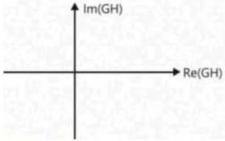

# Polar plot

complex value

Plot of G(jω)H(jω) for various values of ω on complex plane.

x-axis: Re [G(jω)H(jω)]

y-axis: Im [G(jω)H(jω)]

GH = Re (GH) + jIm (GH)

Determine both values at all values of ω[0 → ∞]& plot on the polar plane. Join the dots to get the polar plot.

GH = |GH| ∠GH

magnitude phase