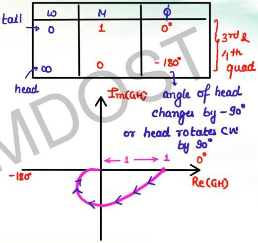

# Addition of a pole

**

$$G(s)H(s) = \frac{1}{(1 + sT_1)(1 + sT_2)}$$

pole added to type-0/order-1
system but not at origin

$$GH(j\omega) = \frac{1}{(1+j\omega T_1)(1+j\omega T_2)}$$

$$M = \frac{1}{\sqrt{1+\omega^2 T_1^2} \sqrt{1+\omega^2 T_2^2}}$$

$$\phi = -\tan^{-1}\omega T_1 - \tan^{-1}\omega T_2$$

