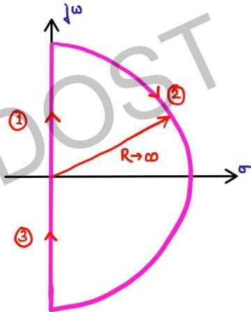

## Question-05

Draw the Nyquist Plot for the function

$$G(s)H(s) = \frac{1}{1+sT} \leftarrow \text{Type-0/order-1}$$

$$G(j\omega)H(j\omega) = \frac{1}{1+j\omega T}$$

polar plot is already known
no poles at origin so no need
to by pass origin in Nyquist
contour.

