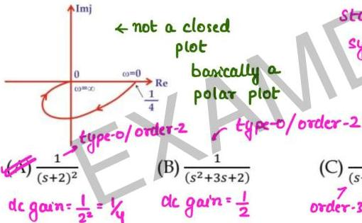

## Question-07

Consider the Nyquist plot shown in figure, which one of the following transfer functions represent this plot?

at $\omega = 0$  $M = 1/4 = dc$ gain

standard plot of type-0/order-2
system

(C) $\frac{1}{(s+2)^3}$
order-3

(D) $\frac{1}{(s+2)}$
order-1