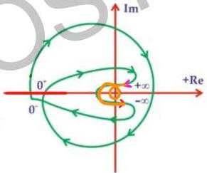

**SN

1 circle of ω radius = 2 infinite semi circle

∴ type = 2

# Question-08

Which of the following is the transfer function of a system having the Nyquist

plot in figure?

$$\omega = 0^+ \quad \phi = -180 \quad (tail)$$

(A) $$\frac{K}{s(s+2)^2(s+5)}$$

$$\angle tail = -90 \times type$$

(B) $$\frac{K}{s^2(s+2)(s+5)} \quad p=4 \quad z=0$$

$$type = 2$$

(C) $$\frac{K(s+1)}{s^2(s+2)(s+5)} \quad p=4 \quad z=1$$

$$\omega \to \infty \quad \phi = -360^\circ \quad (head)$$

(D) $$\frac{K(s+1)(s+3)}{s^2(s+2)(s+5)}$$

$$\angle head = -90 \quad (P-Z) = -360$$

$$p=4 \quad z=2$$

$$p-z=4$$

$$\angle head$$ & $$\angle tail$$ valid for min in $$\phi$$ system