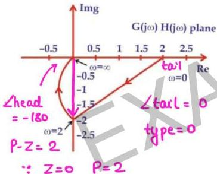

# Question-09

→ no zeroes

The Nyquist plot of an all-pole second order open-loop system is shown in figure. Obtain the transfer function of the system.

$$\begin{aligned} & \text{type-0/order-2} \\ & \frac{K}{(1+ST_1)(1+ST_2)} \\ & \text{at } \omega=0 \quad M=2 = \text{dc gain} \\ & \therefore K=2 \end{aligned}$$