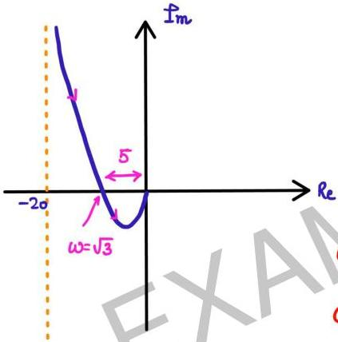

curve-2: $$s = \lim_{R \to \infty} Re^{j\theta} : \theta = \pi/2 \text{ to } -\pi/2$$
$$R \to \infty$$

$$G(s) = \lim_{R \to \infty} \frac{5(Re^{j\theta} + 3)}{Re^{j\theta}(Re^{j\theta} - 1)}$$

$$= \lim_{R \to \infty} \frac{s}{R} e^{-j\theta}$$

radius $$\to 0$$ $$-\theta : -\pi/2 \text{ to } \pi/2$$
(ACW)

curve-4: $$s = \lim_{r \to 0} re^{j\theta} \quad \theta : -\pi/2 \text{ to } \pi/2$$
$$r \to 0 \quad \quad \quad \quad \quad \quad \quad \quad \quad \quad \quad \quad \quad \quad \quad \quad \quad \quad \quad \quad \quad \quad \quad \quad \quad \quad \quad \quad \quad \quad \quad \quad \quad \quad \quad \quad \quad \quad \quad \quad \quad \quad \quad \quad \quad \quad \quad \quad \quad \quad (ACW)$$

$$G(s) = \lim_{r \to 0} \frac{s(3 + re^{j\theta})}{re^{j\theta}(-1 + re^{j\theta})}$$