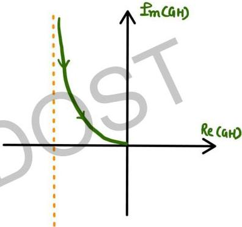

$$GH(j\omega) = \frac{j(1+2\sigma j\omega)}{2\omega(1+400\omega^2)}$$
$$= \frac{-10}{1+400\omega^2} + \frac{j}{2\omega(1+400\omega^2)}$$

$$\omega \rightarrow 0 \quad Re = -10$$
$$\hat{I}_m \rightarrow \infty$$

