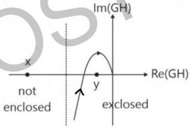

** SN

# Enclosement & Encirclement

Enclosement : used with polar plot
Encirclement: used with Nyquist plot

- polar plot is not a closed plot that is it starts & ends at different points so we do not talk about encirclement but we talk about enclosement.
- When we walk on polar plot in the dir \( n \) of polar plot then a point lying on our right side is said to be enclosed by polar plot.
- A point lying inside a closed curve is said to be encircled by closed curve.