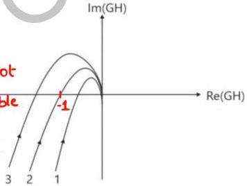

# ** Stability using Polar Plot

- valid only for minimum phase system but Nyquist criteria is applicable to all systems. G(s)H(s) has all poles & zeroes in LHP
- for CL stability, we check for enclosement of \((-1,0)\) point by polar plot of \(G(s)H(s)\).

system-1: (-1,0) point is not enclosed
↪ system is stable

system -2: (-1,0) point lies on polar plot
↪ system is marginally stable

system-3: (-1,0) point enclosed by polar plot
↪ unstable

