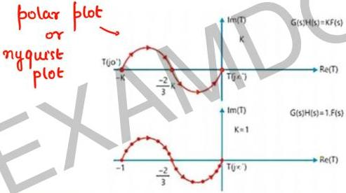

# Multiplying Gain

If we want to multiply the gain

$$T_2(s) = KF(s) \rightarrow PLOT = ?$$

whenever we multiply constant $k > 0$ to a transfer function, then all point on polar or nyquist plot get multiplied by $k$.

* the magnitude of each point on graph becomes K times.

