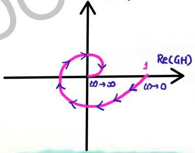
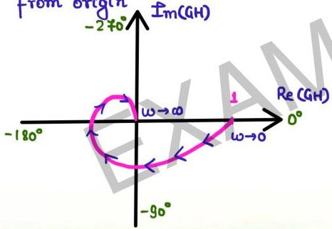

# General shapes

$$G(s)H(s) = \frac{1}{(1 + sT_1)(1 + sT_2)(1 + sT_3)} G(s)H(s) \frac{1}{(1 + sT_1)(1 + sT_2)(1 + sT_3)(1 + sT_4)}$$

one more pole added away

from origin

head moves to origin along -360° line

