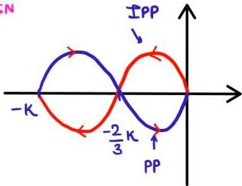
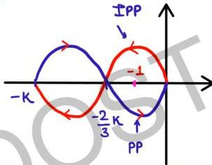

**
SN

assume OLTF is stable,
determine range of K
s.t. CLTF is stable.

P = 0 ; no OL poles in
RHP

Case-01:

$$-\frac{2}{3}K < -1$$

$$K > \frac{3}{2}$$

(-1,0) encircled once in ACW $\text{dist}^n$

$$N = 1$$

$$N = P - Z = O - Z$$

$$Z = -1 \text{ (impossible)}$$

if contour is reversed

$$N = -1 \text{ (ACW)}$$

$$Z = 1 \text{ (unstable)}$$