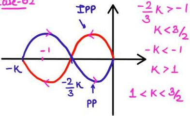
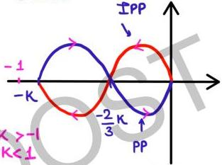

Case-02

-1 encircled once in CW dist*

N = -1 (CW)

P = 0

N = P - Z = -1

Z = 1

CL system is unstable

** SN

Case-03

-1 is not encircled

N = 0 ∴ P = 0 Z = 0

Z = 0 : no CL pole in RHP

CL system is stable

(K < 1)