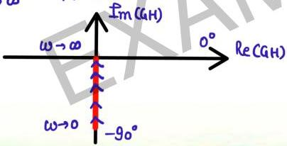
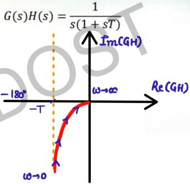

# General shapes

$$G(s)H(s) = \frac{1}{s}$$

$$GH(j\omega) = \frac{1}{j\omega} = \frac{1}{\omega} \angle -90^\circ$$

$$M = \frac{1}{\omega} \quad \phi = -90^\circ : fixed$$

$$\omega \to 0 \quad M \to \infty$$

$$\omega \to \infty \quad M \to 0$$

