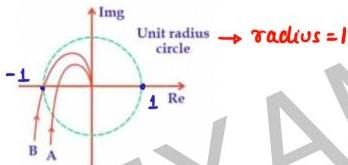

## Question-06

Consider the polar plot of two systems as shown below, Then,

for A,  $(-1,0)$ : not enclosed stable

for B,  $(-1,0)$ : on polar plot marginally stable

(A) A is unstable

(C) B is marginally stable

(B) A is stable

(D) B is unstable