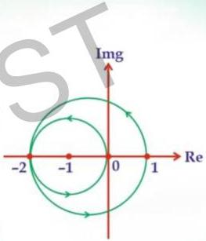

# Question-07

Consider the Nyquist plot of an open loop system G(s) shown in the figure. It is known that G(s) has two unstable poles. The closed loop system shown with unity negative feedback system is

G(s) has 2 poles in RHP: P=2
encirclement of (-i,0): twice ACW N=2

(A) unstable with two poles in the right hand side of s-plane

(B) stable

(C) marginally stable

(D) unstable with 4 poles in the right hand side of s-plane.

$$N = P - Z$$

$$Z = 0 \text{ no CLP in RHP}$$

