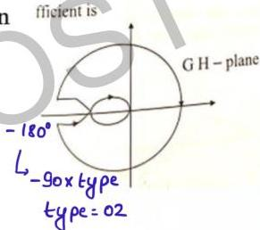

## Question-09

Nyquist plot of a certain stable system is given below. The acceleration error coefficient is

(a) 0

(b)  $\infty$

(c)  $-\infty$

(d)  $10^2$

2 infinite sc

&  $\angle tail = -180^\circ$

system is type-02

$K_a = finite$

