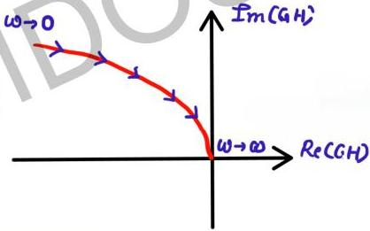

# General shapes

$$G(s)H(s) = \frac{1}{s^2}$$
$$GH(j\omega) = \frac{1}{(j\omega)^2} = \frac{1}{\omega^2} \angle -180^\circ$$
$$\phi = -180^\circ : fixed$$

$$\omega \to 0 \quad M \to \infty \quad \omega \to \infty \quad M \to 0$$

$$\begin{array}{c} -180^\circ \\ \downarrow \\ \omega \to 0 \end{array} \quad \begin{array}{c} \omega \to \infty \\ \uparrow \\ \omega \to \infty \end{array} \quad \begin{array}{c} \uparrow \\ \text{Re(GH)} \end{array}$$

1 pole at origin added to
$$G(s)H(s) = \frac{1}{s^2(1+sT)}$$