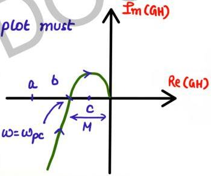

** SN

# Mathematical Calculation

← Frequency domain

Step-1. Compute $\omega_{pc}$ → freq. at which polar plot & nyquist plot intersect -ve real axis

Step-2. Compute magnitude of GH(jω) at ωpc

Step-3. Gain Margin = $\frac{1}{|GH(j\omega)|_{\omega=\omega_p}}$

for marginally stable system, polar plot must pass through (-1,0) point

a=-1, (-1,0) not enclosed by PP (M<1) stable

b=-1, (-1,0) lies on boundary of PP mar. stable (M=1)

c=-1, (-1,0) enclosed by PP : unstable (M>1)

