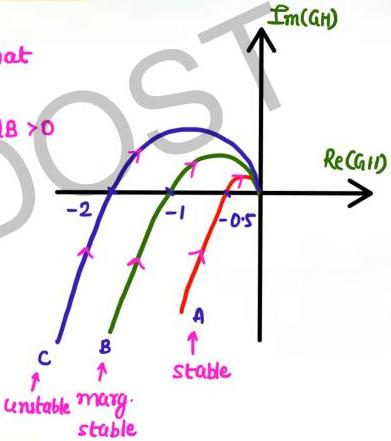

# Mathematical Calculation

o to make A mar. stable

↳ multiply by a factor of 2 so that
PP passes through (-1,0)

$$GN = 2 \quad GN(dB) = 20 \log 2 = 6dB \times 0$$

o B is already mar. stable

$$GN = 1 \quad GN(dB) = 0dB$$

o to make C mar. stable

↳ multiply by a factor of ½ so
that PP passes through (-1,0)

$$GN = \frac{1}{2} \quad GN(dB) = 20 \log \frac{1}{2}$$
$$= -6dB < 0$$

