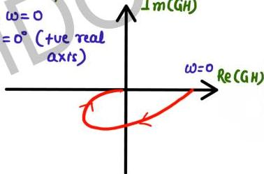

# Question-04

**
SN

polar plot never intersect -ve real axis

∴ system is always stable

$GN = \omega dB$

$\omega_{pc} \leftrightarrow \begin{pmatrix} 0 \\ \infty \\ \text{complex} \end{pmatrix}$

OLTF of C.L.S. with negative feedback. Calculate Gain Margin.

$$G(s)H(s) = \frac{1}{(s+1)(s+2)}$$

$$GH(j\omega) = \frac{1}{(1+j\omega)(2+j\omega)}$$

$$\phi = -\tan^{-1}\omega - \tan^{-1}\omega/2$$

$$\omega_{pc}: \phi = -180$$

$$-180 = -\tan^{-1}\omega_{pc} - \tan^{-1}\frac{\omega_{pc}}{2}$$

$$180 - \tan^{-1}\omega_{pc} = \tan^{-1}\omega_{pc}/2$$

$$-\omega_{pc} = \omega_{pc}/2$$

$$\omega_{pc} = 0$$

$$\text{at } \omega = 0$$

$$\phi = 0^\circ \text{ (+ve real axis)}$$

$$\hat{I}_m(GH)$$

$$\omega = 0 \quad Re(GH)$$

