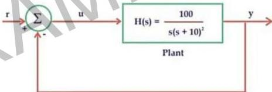

## Question-06

The input-output transfer function of a plant $$H(s) = \frac{100}{s(s+10)^2}$$

The plant is placed in a unity negative feedback configuration as shown in the figure below.

The gain margin of the system under closed loop unity negative feedback is

(A) 0 dB

(B) 20 dB

(C) 26 dB

(D) 46 dB

