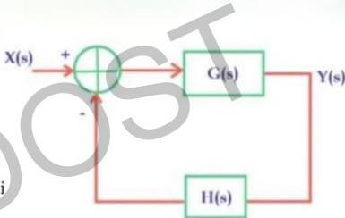

# Question-07

Consider the feedback system

$$G(S) = \frac{K(s+4)}{s(s+1)},\ H(S) = \frac{1}{s+2}$$

The value of gain for which system is marginally stable is

(A) K = 4

$$CE: 1 + G(s)H(s) = 0$$

(B) K = 6

$$s(s+1)(s+2) + K(s+4) = 0$$

(C) K = 10

$$s^2 + 3s^2 + (2+K)s + 4K = 0$$

(D) K = 2

max. stable:  $EP = EP$

$$3(2+K) = 4K \quad 6 + 3K = 4K$$
$$K = 6$$

