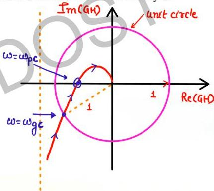

# Gain Cross-Over Frequency

**SN

→ magnitude

The frequency at which the gain of the Transfer Function becomes unity is called as Gain Crossover Frequency.

- magnitude is distance of a point on polar plot from origin.
- $\omega_{gc}$ is the freq at which $mag=1$ or polar plot intersects unit circle.

