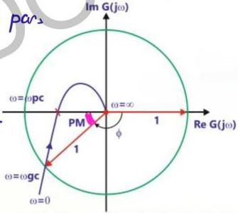

# Using Nyquist Plot

The point at which the polar plot intersects the negative real axis represents phase crossover frequency.

The point at unit distance from the origin on the polar plot represents the origin on the polar plot and represents the gain cross-over frequency.

o marginally stable system: PP must pass through (-1,0) i.e. 1/180°

o at ω = ωgc M = 1 unit
o PM is the angle by which this point must be rotated to make φ = 180°

