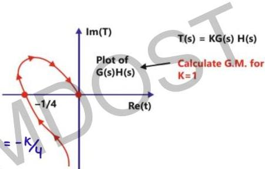

# Question-01

$$T(s) = KG(s)H(s)$$
Calculate G.M. for K = 1

for gain K all intercept

get multiplied by K

intersection with -ve real axis = -K/4

for marginally stable system

$$-K/4 = -1 \quad K = 4$$

$$(GM)_{dB} = 20 \log 4 = 12 \text{ dB}$$

