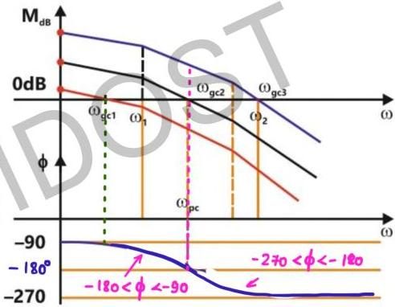

** ΣN

# Using Bode Plot

ωgc: ω at which gain = 1

Gain = 1 = 0 dB

Multiple magnitude plot have been obtained by varying K as K affects only magnitude and not phase.

If magnitude plot changes ωgc also varies

$$G(s) H(s) = \frac{K}{s(1+s/\omega_1)(1+s/\omega_2)}$$

ωpc: φ = -180° i.e. phase plot cuts -180°