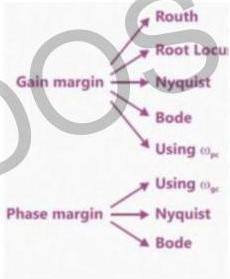

# Summary

$$\omega_{pc} \angle G(j\omega) = -180$$

$$\omega_{gc} |G(j\omega)| = 1$$

Phase Margin = 180 + $$\angle G(j\omega)$$ | $$\omega_{gc}$$

Gain Margin = $$\frac{1}{|G(j\omega)|_{\omega_{pc}}}$$

Phase Margin = 180 + $$\angle G(j\omega)$$ | $$\omega_{gc}$$