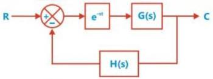

# System with Transportation Lag

**sN

in freq. domain never

approximate $e^{-sT}$ as

$(1-sT)$

$$
\begin{array}{l} f(s) = e^{-sT} G(s) H(s) \\ = e^{-sT} T(s) \\ \end{array}
$$

$$
f(j\omega) = e^{-j\omega T} T(j\omega)
$$

$$
|f(j\omega)| = |T(j\omega)|
$$

$$
\angle f(j\omega) = -\omega T + \angle T(j\omega)
$$