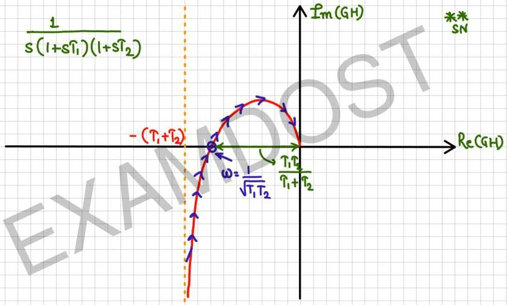

$$\frac{1}{s(1+st_1)(1+st_2)}$$

$$\uparrow \hat{L}_m(GH)$$

$$\begin{array}{c} \text{**} \\ \text{SN} \end{array}$$

$$-(T_1+T_2)$$

$$\omega = \frac{1}{\sqrt{T_1 T_2}}$$

$$\frac{T_1 T_2}{T_1 + T_2}$$

$$\rightarrow Re(GH)$$