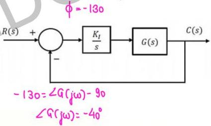

# Question-17

$$\begin{array}{l} F(s) = K_{f/s} G(s) \quad F(j\omega) = K_{f/j\omega} G(j\omega) \\ \phi = \angle G(j\omega) - 90^\circ \end{array}$$

Consider the stable closed-loop system shown in the figure. The magnitude and phase values of the frequency response of $G(s)$ are given in the table. The value of the gain $K_1 (> 0)$ for a $50^\circ$ phase margin is ______ (rounded off to 2 decimal places). $\text{PM} = 50 \approx 180 + \phi$

|  ω in rad / sec | Magnitude in dB | Phase in degrees  |
| --- | --- | --- |
|  0.5 ✓ | -7 | -40  |
|  1.0 | -10 | -80  |
|  2.0 | -18 | -130  |
|  10.0 | -40 | -200  |

