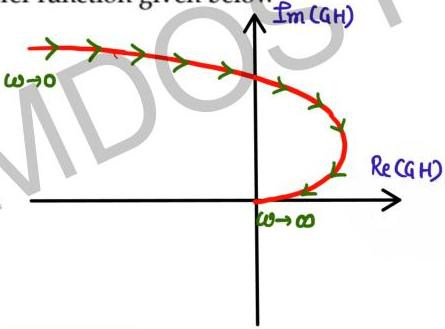

# Question-01

Sketch the polar plot for the transfer function given below

$$G(s) = \frac{1}{s^2(s+1)(2s+1)}$$

Type-02/order-4

angle of tail = -90 x type

$$= -180^\circ$$

angle of head = -90° x (P-Z)

$$= -90 (4-0)$$

$$= -360^\circ$$

