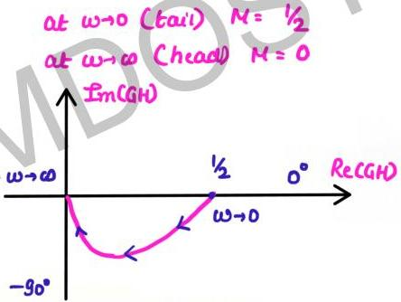

# Question-02

$$M = \frac{\sqrt{4+\omega^2}}{\sqrt{1+\omega^2}\sqrt{16+\omega^2}} \quad \phi = \tan^{-1}\omega/2 \\ -\tan^{-1}\omega - \tan^{-1}\omega/4$$

Sketch the polar plot for the transfer function given below

$$G(s) = \frac{s+2}{(s+1)(s+4)}$$

angle of tail = $-90^\circ \times \text{type}$
$= 0^\circ$

angle of head = $-90^\circ \times (P-2)$
$= -90^\circ (2-1)$
$= -90^\circ$

$$G(j\omega) = \frac{(2+j\omega)}{(1+j\omega)(4+j\omega)}$$

