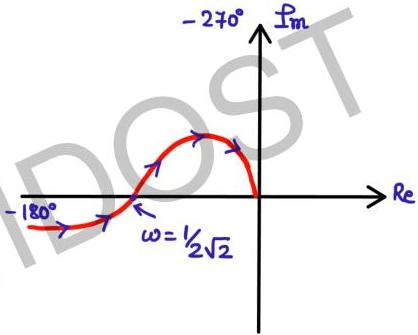

$$4(1-2\omega^2) = 3$$

$$8\omega^2 = 1$$

$$\omega = \frac{1}{2}\sqrt{2} \leftarrow \text{phase cross over freq.}$$

cuts -ve real axis once at

$$\omega = \frac{1}{2}\sqrt{2}$$

|  ω | M | φ  |
| --- | --- | --- |
|  0 | ω | -180  |
|  ω | 0 | -270  |

