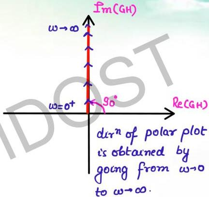

# $T(s) = s$ polar plot

$$T(j\omega) = j\omega \Leftrightarrow \begin{cases} Re = 0 \\ \hat{I}_m = \omega \end{cases}$$

$$= \omega / 90^\circ$$

$$N = \omega \quad \phi = 90^\circ$$

$$\omega \to 0 \quad N \to 0 \quad \phi = 90^\circ$$

$$\omega \to \infty \quad N \to \infty \quad \phi = 90^\circ$$

$\phi$: fixed at $90^\circ$

N: represents distance from origin