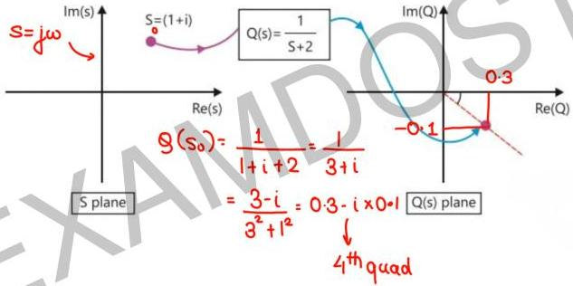

# Mapping Between Rectangular Plane and Complex Plane

• polar plot is mapping of f_m axis in s-plane to G(s)H(s) plane.

NOTE: "In this chapter mapping between Rectangular plane and polar has to be performed under predefined condition."