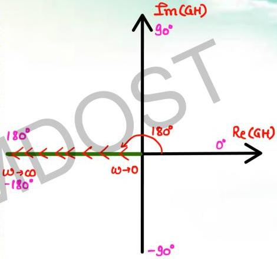

$$T(s) = s^2$$

$$T(j\omega) = (j\omega)^2 = -\omega^2 \quad \begin{array}{c} Re: -\omega^2 \\ \hat{L}_m: 0 \end{array}$$

$$= \omega^2 / 180^\circ$$

$$M = \omega^2 \quad \phi = 180^\circ$$

$$\begin{array}{l} \omega \to 0 \quad M \to 0 \quad \phi = 180^\circ \\ \omega \to \infty \quad M \to \infty \quad \phi = 180^\circ \end{array}$$

$$\begin{array}{l} \phi: \text{fixed at } 180^\circ \\ (-ve \text{ real axis}) \end{array}$$

$$\text{as } \omega \uparrow, \quad M \uparrow$$

$$\text{distance from origin } \uparrow$$

