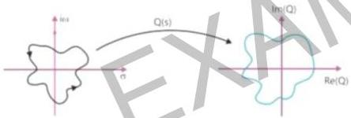

# Points to remember

# 1. Principle of Arguments:

$$Q(s) = \frac{N(s)}{D(s)}$$

If the contour in the $s$ plane contains $p$ poles and $z$ zeros inside it then $Q(s)$ plot in $Q(s)$ plane:

$P > Z$: $Q(s)$ plot in $Q(s)$ plane will encircle the origin $(0,0)(P - Z)$ times in the direction opposite to the contour in $S$ plane

