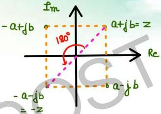

# Case -02

Given: Q(s) plot in Q(s) plane

Plot: -Q(s) plot in -Q(s) plane.

by taking -Q(s), all points on

plot get multiplied by - sign.

when imag. part of a complex no. is multiplied by we take mirror image about real axis.
when real part becomes -ve we take mirror image about \(\hat{I}m\) axis.

when Q(s) is multiplied by
- sign then all points
are reflected to opp quad
or curve rotates ACW by
180°