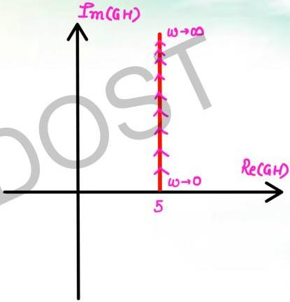

$$T(s) = s + 5$$

$$T(j\omega) = j\omega + 5 \quad \begin{cases} Re: 5 \\ \hat{I}_m: \omega \end{cases}$$

$$Re(T) = 5 = const$$

$$\hat{I}_m(T) = \omega \quad increases \ as$$

$$\omega \ goes \ from \ 0 \ to \ \omega$$

$$\omega \to 0 \quad T(j\omega) = 5 + j0$$

$$\omega \to \infty \quad T(j\omega) = 5 + j\infty$$

