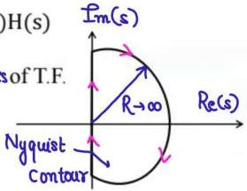

# Points to remember (Nyquist)

** SN

Rule of mapping for nyquist N = Pc - Zc → T.F.

N = no. of encirclement of (0,0) by G(s)H(s) plot in G(s)H(s) plane.

N = +ve → N: ACW (opp. to contour)

N = -ve → N: CW (same dern as contour)

Pc = no. of poles of G(s)H(s) lying inside C=No. of poles of G(s)H(s) lying in R.H.P.

Zc = no. of zeros of T0 F0G(s)H(s) lying inside C = No. of zeros of T.F. G(s)H(s) lying in RHP