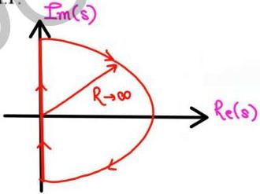

**

CASE 1: N.S.C. for G(s)H(s) = $$\frac{N(s)}{D(s)}$$

N = no. of encirclement of (0,0) by G(s)H(s) plot in G(s)H(s) plane

P+ = no. of poles of T.F. G(s)H(s) lying strictly in RHP

Z+ = no. of zeros of T.F. G(s)H(s) lying strictly in R.H.P.

$$N = P_+ - Z_+$$

$$N = \begin{cases} N > 0 & \text{ACW encirclement} \\ & \text{of origin} \\ N < 0 & \text{CW encirclement} \\ & \text{of origin} \end{cases}$$