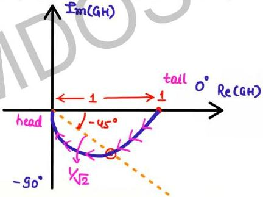

# First Order TF

**
SN

$$G(s)H(s) = \frac{1}{(1+sT)} : \text{type-0 order -1}$$

$$GH(j\omega) = \frac{1}{1+j\omega T}$$
$$= \frac{1}{\sqrt{1+\omega^2 T^2}} \angle -\tan^{-1} \omega T$$

$$M = \frac{1}{\sqrt{1+\omega^2 T^2}} \quad \phi = -\tan^{-1} \omega T$$

|  tail | ω | M | φ  |
| --- | --- | --- | --- |
|   | 0 | 1 | 0°  |
|  ωT=1 | 1/T | 1/√2 | -45°  |
|   | ∞ | 0 | -90°  |

