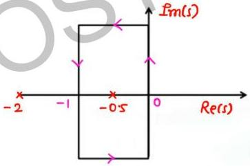

# Question-02

Find the number of origin encirclement in G(s)H(s) plane the if the following contour in s-plane are mapped to G(s)H(s) plane.

$$G(s)H(s) = \frac{1}{(s+2)(s+0.5)}$$

one pole lies inside contour (ACW)
pole gives encirclement of origin opp.
to contour
one encirclement in CW dir