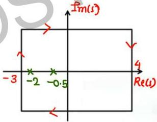

# Question-03

Q.3. Find the number of origin encirclement in G(s)H(s) plane the if the following contour in s-plane are mapped to G(s)H(s) plane.

$$G(s)H(s) = \frac{1}{(s+2)(s+0.5)} \quad \leftarrow \text{poles: } -2, -0.5$$

contour : CW

2 poles inside contour

∴ 2 encirclement of origin
opp. to contour ie ACW