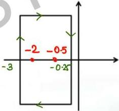

# Question-04

Find the number of origin encirclement in G(s)H(s) plane the if the following contours in s-plane are mapped to G(s)H(s) plane.

G(s)H(s) = (s + 2)(s + 0.5)

Contour: CW

2 zeroes inside contour

2 encirclement of origin in same sense as contour i.e. CW