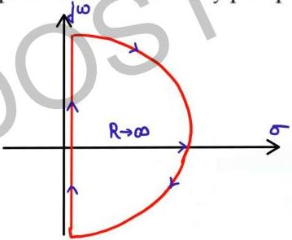

# Nyquist Contour

→ Closed path in s-plane that encloses the entire right half s-plane
→ When nyquist contour is mapped to G(s)H(s) plane then it becomes nyquist plot

o value of 's' lying on the boundary of
nyquist contour must be substituted
in G(s)H(s) to obtain value lying on
Nyquist Plot.

Nyquist contour
s-plane
$$\xrightarrow{G(s)H(s)}$$
Nyquist Plot-
G(s)H(s) plane