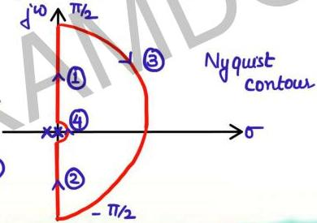

# Mapping of Nyquist Contour

**
SN

Curve 1: $$s = j\omega$$

$$\omega$$ varies from $$0^+ \to \infty$$: polar plot

Curve 2: $$s = -j\omega$$ $$\leftarrow$$ conjugate of $$j\omega$$

\(\rightarrow\) value of \(\mathrm{G(s)H(s)}\) is conjugate of the value obtained in curve - 1
\(\rightarrow\) we get mirror image of polar plot about real axis
\(\rightarrow\) Inverse polar plot

• Nyquist contour
cannot pass through
origin if there
are poles of G(s)H(s)
at origin.

