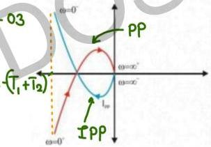

# Inverse Polar Plot

In Polar plot, $s = j\omega$

Inverse polar plot, $s = -j\omega \rightarrow$ conjugate of the polar plot

$$G(s)H(s) = \frac{1}{s(1+sT_1)(1+sT_2)} \leftarrow \text{Type-01/Order-03}$$

Polar Plot: $\frac{1}{j\omega(1+j\omega T_1)(1+j\omega T_2)}$

Inverse PP: $\frac{1}{-j\omega(1-j\omega T_1)(1-j\omega T_2)}$

Conjugate mirror image about Real axis